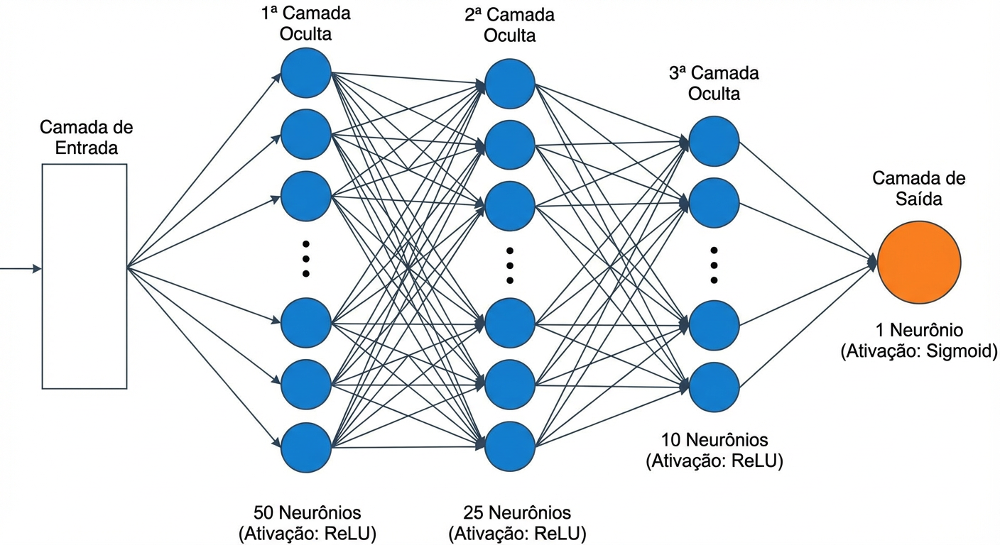
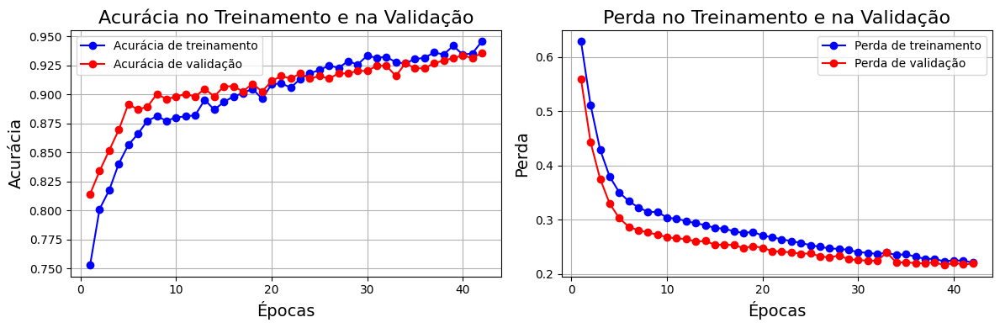

```{r setup, include=FALSE}
knitr::opts_chunk$set(echo=F, message=F, warning=F, fig.pos = 'H',
                      fig.align = 'center', fig.height= 2.3)
library(ggplot2)
source("func.R")
```


```{r, include=FALSE}
### Arrumando dados e análise ###

dados <- readr::read_csv("alzheimers_disease_data.csv")
dados1 <- dados |> dplyr::select("MMSE","FunctionalAssessment","MemoryComplaints","BehavioralProblems","ADL","Diagnosis")
dados1$Diagnosis<-as.factor(dados1$Diagnosis)

# Análise quantitativa:
## MMSE
dMMSE<-analise_2grupo(var_valor = dados1$MMSE,var_cat = dados1$Diagnosis,
                      legx_box = "Diagnóstico Alzheimer",legy_box = "MMSE")
dMMSE$g_box<-dMMSE$g_box +
  annotate("text",x = Inf, y = max(dados1$MMSE)+1,hjust = 1.02, vjust = 0.05,label = paste0("Mann-Whitney (p-valor): <0.001"),color = "gray60", size = 2.25)+
  scale_x_discrete(labels = c("0" = "Não", "1" = "Sim"))
## FunctionalAssessment
dFA<-analise_2grupo(var_valor = dados1$FunctionalAssessment,var_cat = dados1$Diagnosis,
                      legx_box = "Diagnóstico Alzheimer",legy_box = "Avaliação Funcional")
dFA$g_box<-dFA$g_box +
  annotate("text",x = Inf, y = max(dados1$FunctionalAssessment)+1,hjust = 1.02, vjust = 0.05,label = paste0("Mann-Whitney (p-valor): <0.001"),color = "gray60", size = 2.25)+
  scale_x_discrete(labels = c("0" = "Não", "1" = "Sim"))
## ADL
dADL<-analise_2grupo(var_valor = dados1$ADL,var_cat = dados1$Diagnosis,
                      legx_box = "Diagnóstico Alzheimer",legy_box = "ADL")
dADL$g_box<-dADL$g_box +
  annotate("text",x = Inf, y = max(dados1$ADL)+1,hjust = 1.02, vjust = 0.05,label = paste0("Mann-Whitney (p-valor): <0.001"),color = "gray60", size = 2.25)+
  scale_x_discrete(labels = c("0" = "Não", "1" = "Sim"))

# Análise qualitativa:
## MemoryComplaints
dMC<-analise_assoc_cat(V1 = dados1$MemoryComplaints,V2 = dados1$Diagnosis,tipo = 3,
                      bar_legx = "Diagnóstico Alzheimer",bar_legl = "Queixas de memória:")
dMC$g_bar<-dMC$g_bar +
  annotate("text",x = Inf, y = max(dMC$g_bar$data$Freq)+1,hjust = 1.02, vjust = 0.1,label = paste0("Qui-quadrado (p-valor): <0.001"),color = "gray60", size = 2.25) +
  scale_x_discrete(labels = c("0" = "Não", "1" = "Sim")) +
  scale_fill_brewer(palette = "Paired", direction = 1,labels = c("0" = "Não", "1" = "Sim"))
## BehavioralProblems
dBP<-analise_assoc_cat(V1 = dados1$BehavioralProblems,V2 = dados1$Diagnosis,tipo = 3,
                      bar_legx = "Diagnóstico Alzheimer",bar_legl = "Problemas comportamentais:")
dBP$g_bar<-dBP$g_bar +
  annotate("text",x = Inf, y = max(dMC$g_bar$data$Freq)+1,hjust = 1.02, vjust = 0.1,label = paste0("Qui-quadrado (p-valor): <0.001"),color = "gray60", size = 2.25) +
  scale_x_discrete(labels = c("0" = "Não", "1" = "Sim")) +
  scale_fill_brewer(palette = "Paired", direction = 1,labels = c("0" = "Não", "1" = "Sim"))
```

# Introdução

A doença de Alzheimer é uma das condições neurodegenerativas mais prevalentes no mundo, caracterizada por declínio progressivo das funções cognitivas e forte impacto sobre a qualidade de vida dos pacientes e de seus familiares. Diante do crescimento da população idosa, a identificação precoce da doença torna-se cada vez mais relevante, permitindo intervenções mais eficazes e melhor planejamento terapêutico (Social Care Institute for Excellence, 2025). Nesse cenário, técnicas de aprendizado de máquina têm ganhado destaque por sua capacidade de analisar grandes volumes de dados clínicos e identificar padrões que não seriam facilmente percebidos por métodos tradicionais.

Com esse propósito, este estudo utiliza o Alzheimer’s Disease Dataset, disponível publicamente no Kaggle em  [https://www.kaggle.com/datasets/rabieelkharoua/alzheimers-disease-dataset](https://www.kaggle.com/datasets/rabieelkharoua/alzheimers-disease-dataset), que reúne um conjunto abrangente de informações demográficas, clínicas e de estilo de vida de pacientes maior ou igual a 60 anos, contendo 2149 observações. Por incluir variáveis como idade, gênero, IMC, tabagismo, histórico familiar, indicadores de saúde e exames clínicos, o banco oferece uma base adequada para avaliar como diferentes fatores se associam ao diagnóstico da doença.
Desta forma, o objetivo deste trabalho é construir e avaliar um modelo preditivo, utilizando técnicas de machine learning, capaz de estimar a probabilidade de ocorrência de Alzheimer. A partir dessa análise, busca-se investigar o desempenho do modelo, identificar variáveis relevantes.

Inicialmente, realizou-se uma análise descritiva completa das variáveis presentes no banco de dados, complementada por testes de hipóteses, com o objetivo de identificar quais fatores apresentavam evidências de associação com o diagnóstico de Alzheimer. Como o conjunto de dados contém várias variáveis explicativas, optou-se por aprofundar a investigação apenas naquelas que demonstraram algum grau de significância nessa análise preliminar, de modo a direcionar a análise completa para os atributos potencialmente mais relevantes. Dentre as variáveis presentes no banco de dados, serão utilizadas no modelo apenas aquelas que apresentaram evidências de significância na análise descritiva e nos testes de hipóteses iniciais. As variáveis selecionadas pertencem ao grupo de avaliações cognitivas e funcionais, descritas a seguir:

\begin{itemize}
  \item \textbf{MMSE (Mini-Exame do Estado Mental)}: Avalia a memória, a atenção e a capacidade de raciocínio da pessoa. Trata-se de uma pontuação que varia de 0 a 30. Valores mais baixos indicam maior comprometimento cognitivo.
  \item \textbf{Avaliação Funcional}: Avalia quão bem a pessoa consegue realizar atividades do dia a dia de forma independente. É uma pontuação que varia de 0 a 10, em que valores mais baixos representam maior dificuldade funcional.
  \item \textbf{Queixas de memória}: Indica se a pessoa relata problemas de memória. Recebendo o valor 0 para “não” e 1 para “sim”.
  \item \textbf{Problemas comportamentais}: Verifica a presença de alterações comportamentais, como irritabilidade ou agitação. Recebendo o valor 0 para “não” e 1 para “sim”.
  \item \textbf{ADL (Atividades da vida diária)}: Avalia a capacidade da pessoa de realizar tarefas básicas do cotidiano, como comer, vestir-se e tomar banho. A pontuação varia de 0 a 10, sendo que valores mais baixos indicam maior grau de dependência.
  \item \textbf{Diagnóstico}: Indica se a pessoa apresenta ou não Alzheimer. Variável utilizada como resposta no modelo. O valor 0 significa que o indivíduo \textit{não} possui Alzheimer, enquanto o valor 1 indica que o indivíduo \textit{possui} a doença.
\end{itemize}

Para a etapa preditiva, utilizou-se um modelo de machine learning baseado em redes neurais artificiais, implementado com a biblioteca Keras em Python. A escolha desse modelo se deve à sua capacidade de aprender relações complexas entre as variáveis de entrada, adaptando-se bem a padrões não lineares presentes nos dados. Essa flexibilidade torna as redes neurais especialmente adequadas para problemas em que múltiplos fatores podem influenciar simultaneamente o diagnóstico, como é o caso da Doença de Alzheimer.

# Metodologia

Nesta seção serão apresentadas as informações referentes aos testes estatísticos utilizados na etapa descritiva, bem como a estrutura do modelo de Machine Learning adotado para a etapa preditiva.

Para a análise descritiva, utilizamos tabelas e gráficos de acordo com o tipo de cada variável (quantitativa ou qualitativa), verificando a associação que cada uma delas apresenta com a variável resposta. Para as variáveis quantitativas, empregamos tabelas descritivas contendo média, mediana, mínimo, máximo e desvio-padrão (DP), além do teste de normalidade de Shapiro-Wilk (SW), gráficos de boxplot e o teste de hipótese de Mann-Whitney para comparar os grupos com e sem Alzheimer. Para as variáveis qualitativas, utilizamos tabelas de frequência com percentuais por linha (marginais-linha), gráficos de barras representando essas proporções e o teste qui-quadrado de independência para avaliar a associação com o diagnóstico.

## Redes Neurais

As redes neurais foram desenvolvidas utilizando a biblioteca Keras, integrada ao TensorFlow em python, escolhida pela facilidade de uso e pela boa performance no treinamento de modelos. Antes do ajuste, as variáveis quantitativas foram normalizadas por meio de padronização (transformação para média zero e desvio padrão igual a um), procedimento importante para evitar que diferenças de escala entre as variáveis prejudiquem o aprendizado do modelo.

Foi construída uma rede estruturada composta por camadas totalmente conectadas, utilizando-se 70\% das observações para o treinamento do modelo e os 30\% restantes para o conjunto de teste (Figura \ref{fig:div}). Nas camadas ocultas utilizou-se a ativação ReLU, por favorecer o aprendizado de relações não lineares, enquanto a camada final adotou a ativação sigmoid, adequada para classificação binária por gerar probabilidades entre 0 e 1.

```{r div, out.width='50%', fig.cap= "Divisão entre treino e teste."}

```

A etapa de compilação empregou o otimizador Adam e a função de perda binary crossentropy, configuração padrão e eficiente para esse tipo de tarefa. O treinamento ocorreu por retropropagação dos erros, com ajuste iterativo dos pesos ao longo das épocas. Para evitar sobreajuste, 30% dos dados de treino foram destinados à validação interna, e aplicou-se a técnica de Early Stopping, que interrompe o treinamento quando a perda de validação deixa de melhorar após três iterações consecutivas. Essa estratégia permitiu selecionar automaticamente o ponto de melhor desempenho validado, reduzindo o risco de o modelo se ajustar excessivamente ao conjunto de treino.

O desempenho do classificador foi avaliado por meio da matriz de confusão, construída a partir das predições fornecidas pela rede neural. Como a saída do modelo é uma probabilidade entre 0 e 1, adotou-se o ponto de corte padrão de 0.5, classificando valores maiores ou iguais a 0.5 como diagnóstico positivo de Alzheimer e valores inferiores a 0.5 como negativo. A partir dessa classificação, foram calculadas as métricas de acurácia, sensibilidade, especificidade e precisão, permitindo analisar tanto o desempenho geral do modelo quanto sua capacidade específica de identificar corretamente os casos positivos e negativos da doença.

# Análise Descritiva

Nesta seção, são apresentadas as análises descritivas das variáveis quantitativas e qualitativas selecionadas para o estudo. Na Tabela \ref{tab:desc1} estão descritas as medidas descritivas das variáveis quantitativas em relação ao diagnóstico de Alzheimer, juntamente com o $p$-valor do teste de normalidade de Shapiro-Wilk. Observa-se que, para as três variáveis, a média e a mediana apresentam valores menores nos indivíduos diagnosticados com Alzheimer. Os escores de MMSE, Avaliação Funcional e ADL apresentam, portanto, comportamentos inferiores quando comparados aos indivíduos sem diagnóstico. Em todas as variáveis, não houve evidência de normalidade dos dados; assim, para verificar se as diferenças observadas são realmente significativas, utilizaremos testes de hipóteses não paramétricos, neste caso, o teste de Mann-Whitney. Esses resultados estão ilustrados na Figura \ref{fig:gdesc1}, que apresenta gráficos de boxplot das variáveis quantitativas em relação ao diagnóstico de Alzheimer. Para as três variáveis, é possível perceber visualmente as diferenças já observadas na tabela, e os testes estatísticos confirmam a significância dessas diferenças por meio dos $p$-valores.

\begin{table}[H]
\caption{Resultados descritivos das variáveis quantitativas em estudo em relação ao diagnóstico de Alzheimer e teste de normalidade de Shapiro-Wilk(SW).}
\label{tab:desc1}
\centering
\begin{tabular}[t]{lrrrrrrrr}
\hline
 Diagnóstico & n & Mín. & Mediana & Média & Máx. & DP & SW($p$-valor) & NA's\\
\hline
\multicolumn{8}{l}{\textbf{MMSE}}\\
\quad Não & 1389 & 0.005 & 17.146 & 16.266 & 29.991 & 8.933 & $<$0.001 & 0\\
\quad Sim & 760 & 0.051 & 11.566 & 11.995 & 29.960 & 7.226 & $<$0.001 & 0\\
\multicolumn{8}{l}{\textbf{Avaliação Funcional}}\\
\quad Não & 1389 & 0.012 & 6.244 & 5.861 & 9.996 & 2.761 & $<$0.001 & 0\\
\quad Sim & 760  & $<$0.001 & 3.299 & 3.653 & 9.928 & 2.567 & $<$0.001 & 0\\
\multicolumn{8}{l}{\textbf{ADL}}\\
\quad Não & 1389 & 0.015 & 6.135 & 5.708 & 10.000 & 2.827 & $<$0.001 & 0\\
\quad Sim & 760 & 0.001 & 3.236 & 3.658 & 9.945 & 2.701 & $<$0.001 & 0\\
\hline
\end{tabular}
\end{table}


```{r,eval=FALSE}
knitr::kable(dMMSE$Tab_descr,format = "latex")
knitr::kable(dFA$Tab_descr,format = "latex")
knitr::kable(dADL$Tab_descr,format = "latex")
```


```{r gdesc1,fig.cap="Boxplots para as variáveis quantitativas em relação ao diagnóstico de Alzheimer."}
cowplot::plot_grid(dMMSE$g_box,dFA$g_box,dADL$g_box,ncol = 3)
```


```{r,eval=FALSE}
knitr::kable(dMC$Tab,format = "latex")
knitr::kable(dBP$Tab,format = "latex")
```

Essas diferenças sugerem que indivíduos com diagnóstico de Alzheimer apresentam pior desempenho cognitivo e funcional: os escores mais baixos de MMSE indicam déficits cognitivos, os valores reduzidos na Avaliação Funcional refletem menor autonomia nas atividades diárias, e os menores escores de ADL evidenciam comprometimento nas atividades de autocuidado.


Pela Tabela \ref{tab:desc2} são apresentadas as frequências absolutas e os percentuais marginais-linha das variáveis categóricas em estudo em relação ao diagnóstico de Alzheimer. Primeiramente, observa-se uma diferença considerável na quantidade de observações entre indivíduos diagnosticados com Alzheimer e aqueles sem diagnóstico, com aproximadamente 21\% dos pacientes diagnosticados apresentando queixas de memória e cerca de 16\% apresentando problemas comportamentais.

\begin{table} [H]
\caption{Resultados descritivos com as marginais-linha das variáveis quantitativas em estudo em relação ao diagnóstico de Alzheimer.}
\label{tab:desc2}
\small
\centering
\begin{tabular}[t]{lrrrr}
\hline
  & & \multicolumn{2}{c}{Diagnóstico Alzheimer} & \\
\cline{3-4}
Variáveis & \multicolumn{1}{c}{n(\%)} & \multicolumn{1}{c}{Não(\%)}  &\multicolumn{1}{c}{Sim(\%)} & \multicolumn{1}{c}{NA's} \\
\hline
\multicolumn{4}{l}{\textbf{Queixas de memória}} &  \\
\quad Não & 1702(79.2) & 1228(72.15) & 474(27.85) & 0\\
\quad Sim & 447(20.8) & 161(36.02) & 286(63.98) & 0\\
\multicolumn{4}{l}{\textbf{Problemas comportamentais}} &  \\
\quad Não & 1812(84.32) & 1255(69.26) & 557(30.74) & 0\\
\quad Sim & 337(15.68) & 134(39.76) & 203(60.24) & 0\\
\hline
\end{tabular}
\end{table}

Diante dessa grande desproporção entre os níveis, a utilização das marginais-linha é fundamental para que a análise considere a proporcionalidade das observações, e não apenas as frequências absolutas, que podem induzir a interpretações equivocadas devido a escalas desproporcionais. Ao analisarmos os percentuais, percebemos que há uma diferença relevante quando o paciente apresenta queixas de memória ou problemas comportamentais: 63.98\% dos pacientes com queixas de memória apresentam Alzheimer, enquanto 36.02\% não apresentam essas queixas; para problemas comportamentais, 60.24\% dos pacientes apresentam Alzheimer, enquanto 39.76\% não apresentam problemas comportamentais.

Essas diferenças podem ser visualizadas na Figura \ref{fig:gdesc2}, que apresenta gráficos de barras das marginais-linha, juntamente com o $p$-valor do teste Qui-quadrado de independência, confirmando estatisticamente a significância das diferenças observadas.

```{r gdesc2,fig.cap="Percentual linha para variáveis qualitativas em relação ao diagnóstico de Alzheimer."}
cowplot::plot_grid(dMC$g_bar,dBP$g_bar)
```

Esses resultados sugerem que pacientes diagnosticados com Alzheimer têm maior probabilidade de apresentar queixas de memória e problemas comportamentais, evidenciando que essas variáveis estão fortemente associadas à presença da doença e podem ser úteis na caracterização do quadro clínico.


Com base nos resultados da análise descritiva, podemos agora estruturar nosso modelo de machine learning utilizando as variáveis analisadas.

# Machine Learling

Nesta seção, apresenta-se o modelo de redes neurais desenvolvido utilizando a biblioteca Keras integrada ao TensorFlow em Python, detalhando sua estrutura, procedimentos de pré-processamento, configuração de treinamento e avaliação de desempenho. 

Para treinar o modelo, utilizou-se a base de treino composta por 1504 observações. Na Figura \ref{fig:camadas} apresenta-se a estrutura da rede neural, que inicia com a alimentação das variáveis explicativas analisadas anteriormente. O modelo possui três camadas ocultas: a primeira com 50 neurônios, a segunda com 25 neurônios e a terceira com 10 neurônios, todas utilizando a função de ativação ReLU. A camada final é a camada de saída, com ativação Sigmoid, permitindo obter resultados na escala de probabilidades.

```{r camadas, out.width='92%', fig.cap= "Estrutura do modelo de redes neurais totalmente conectadas."}

```

```{r epocas, out.width='93%', fig.cap= "Grágico de linha para a acurácia e perda no treinamento e validação do modelo."}

```


O treinamento foi realizado com divisão interna de 30% dos dados de treino para validação, utilizando o otimizador Adam e a função de perda binary crossentropy. Aplicou-se a técnica de Early Stopping, que interrompe o treinamento quando a perda de validação deixa de melhorar por três iterações consecutivas, prevenindo sobreajuste. Como pode ser observado na Figura \ref{fig:epocas}, que apresenta os gráficos de acurácia e perda durante o treinamento e a validação, é possível visualizar o comportamento do modelo ao longo das épocas, evidenciando o ponto em que o treinamento foi interrompido, totalizando 42 épocas. Esse gráfico permite analisar a evolução da aprendizagem do modelo e verificar que não houve sobreajuste durante o treinamento.


Com o modelo treinado, aplicou-se a base de teste para avaliar o desempenho do classificador. A Tabela \ref{tab:confu} apresenta a matriz de confusão obtida a partir das predições do modelo de redes neurais desenvolvido com Keras. A partir da matriz de confusão, foram calculadas as métricas de desempenho do modelo, incluindo acurácia, sensibilidade (recall), especificidade e precisão. A acurácia do modelo foi de 91.63\%, indicando que a maioria das observações da base de teste foi classificada corretamente. A sensibilidade, de 89.04\%, evidenciou a capacidade do modelo de identificar corretamente os pacientes com Alzheimer. A especificidade, de 93.05\%, mostrou que o modelo acertou a maior parte dos casos negativos, enquanto a precisão, de 87.50\%, indicou que a proporção de predições positivas corretas também foi alta.


\begin{table}[H]
\centering
\caption{Matriz de confusão para o diagnóstico de alzheimer do modelo de redes neurais pelo keras.}
\label{tab:confu}
\begin{tabular}{l|cc|r}
\hline
 & \multicolumn{2}{c|}{Previsto} & \\
\cline{2-3}
Real & Não & Sim & Total \\
\hline
Não & 388 & 29 & 417 \\
Sim & 25 & 203 & 228 \\
\hline
Total & 413 & 232 & 645 \\
\hline
\end{tabular}
\end{table}

Esses resultados demonstram que o modelo de redes neurais apresentou bom desempenho na classificação binária, conseguindo identificar adequadamente tanto os casos positivos quanto os negativos, com baixo risco de falsos positivos e falsos negativos, mostrando-se confiável para auxiliar na detecção de Alzheimer com base nas variáveis analisadas.

```{r, eval=TRUE}
Acurracia = (388+203)/645
Sensibilidade = 203/228
Especificidade = 388/417
Precisao = 203/232
```

# Conclusão

O presente estudo teve como objetivo analisar variáveis clínicas e funcionais relacionadas ao diagnóstico de Alzheimer e avaliar a capacidade de um modelo de redes neurais em classificar corretamente os pacientes. As análises descritivas evidenciaram que indivíduos diagnosticados com Alzheimer apresentam desempenho inferior em MMSE, Avaliação Funcional e ADL, além de maior frequência de queixas de memória e problemas comportamentais, indicando diferenças claras entre os grupos estudados.

Com base nessas variáveis, o modelo de redes neurais desenvolvido apresentou bom desempenho na classificação, alcançando elevada acurácia, sensibilidade, especificidade e precisão. A matriz de confusão mostrou que o modelo consegue identificar corretamente tanto os casos positivos quanto os negativos, com baixo risco de falsos positivos e falsos negativos.

Esses resultados demonstram que as variáveis selecionadas são relevantes para caracterizar o quadro clínico dos pacientes e que redes neurais podem ser uma ferramenta confiável de apoio à detecção de Alzheimer, possibilitando a identificação de padrões complexos nos dados que seriam difíceis de capturar apenas por análises descritivas.

# Referências

Rabie El Kharoua. \textit{Alzheimer's Disease Dataset}. Kaggle, 2024. Disponível em: \url{https://www.kaggle.com/dsv/8668279}. Acesso em: 30 nov. 2025.

Social Care Institute for Excellence. \textit{Early diagnosis of dementia}. Disponível em: \url{https://www.scie.org.uk/dementia/symptoms/diagnosis/early-diagnosis.asp}. Acesso em: 30 nov. 2025.


